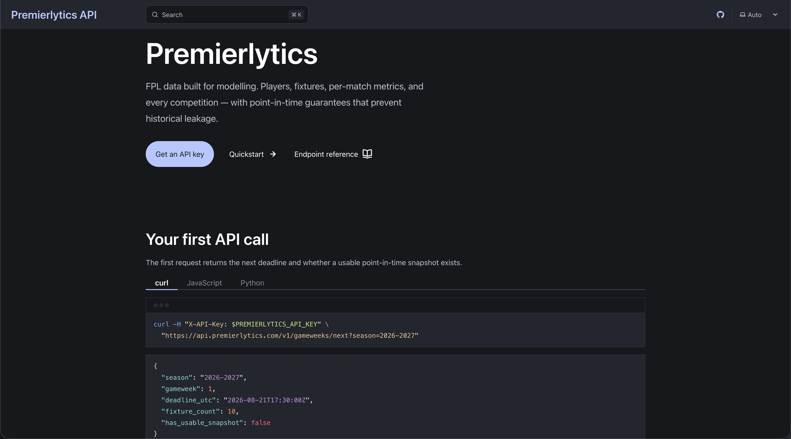
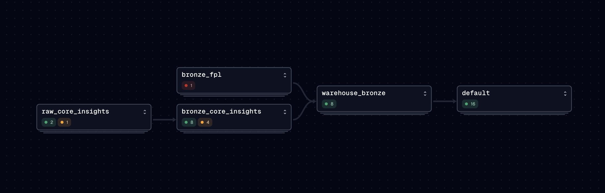
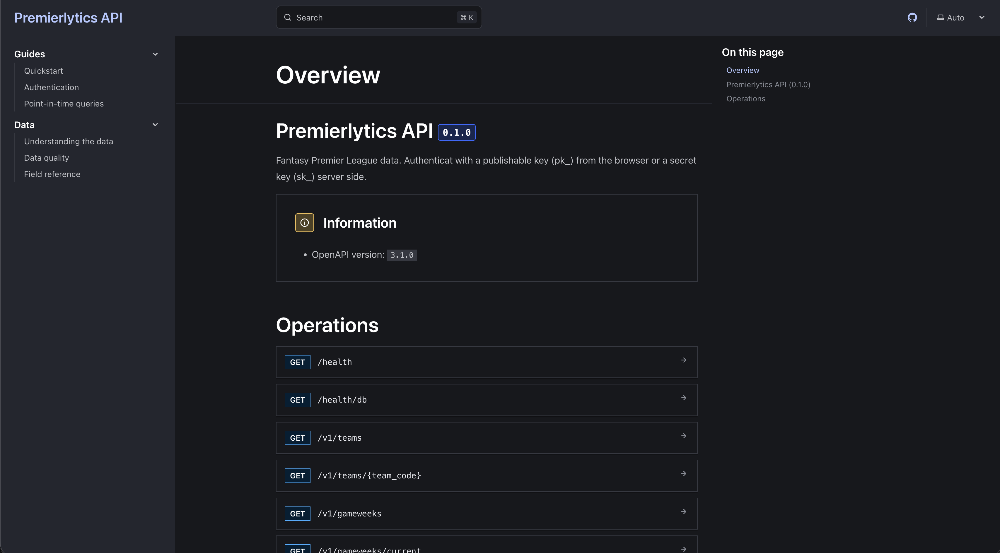
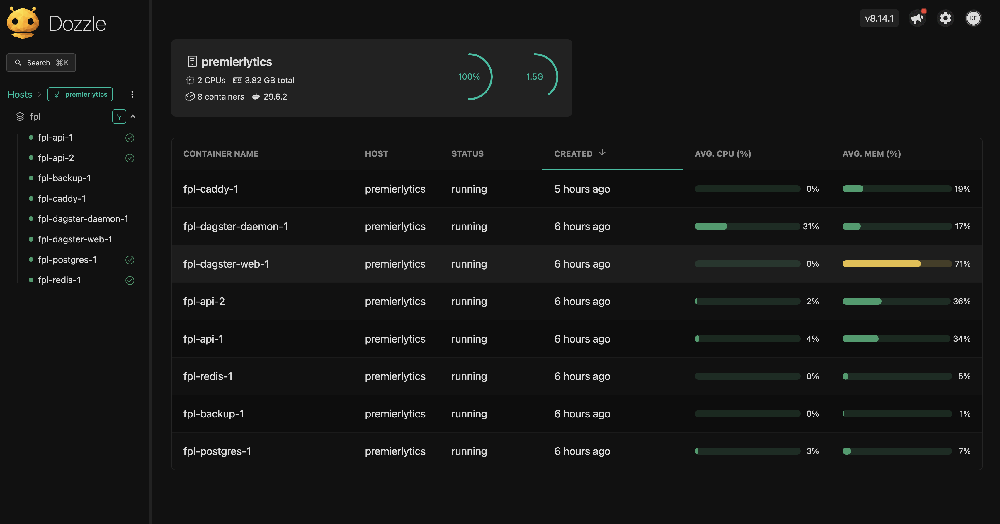

# FPL Data Platform

[](https://github.com/KenImade/fpl-data-platform/actions/workflows/ci.yml)

**FPL data built for modelling.**

Premierlytics is a Fantasy Premier League data warehouse and REST API designed for machine learning and analytics. It captures FPL data with strict point-in-time guarantees — so models trained on historical data can't accidentally see the future.

<!-- SCREENSHOT: Landing page of premierlytics.com showing the hero section and quickstart code snippet -->

---

## Table of Contents

- [Overview](#overview)
- [Architecture](#architecture)
- [Tech Stack](#tech-stack)
- [Getting Started](#getting-started)
- [Development](#development)
- [API Reference](#api-reference)
- [Production Deployment](#production-deployment)
- [Project Structure](#project-structure)

---

## Overview

The platform solves a common problem in FPL modelling: historical FPL data is mutable. Player prices, ownership, and availability change week to week, but the official API only returns the current state. Training a model on naively scraped data introduces leakage — you end up using information that wasn't available at the time of prediction.

Premierlytics fixes this by:

- **Capturing snapshots** near each gameweek deadline and storing them immutably in S3
- **Stamping every row** with a `snapshot_at` timestamp so consumers can filter to any point in history
- **Exposing clean fact and dimension tables** via a versioned REST API, with the hard data-modelling decisions already made (e.g. double-gameweek handling, bonus point allocation)

<!-- DIAGRAM: High-level architecture showing FPL API → capture → S3 → dbt → PostgreSQL → REST API → consumers -->

---

## Architecture

Data moves through four layers:

| Layer | Technology | Purpose |
| --- | --- | --- |
| **Capture** | httpx + Dagster sensor | Poll the FPL API near deadlines, write raw JSON snapshots to S3 |
| **Bronze** | Polars + PyArrow | Parse raw JSON into typed Parquet, load into `analytics_bronze` schema |
| **Transform** | dbt | Staging views → analytics marts (dimensions + facts) |
| **Serve** | FastAPI + asyncpg | Read-only API over `analytics_marts`, with key auth and rate limiting |

<!-- DIAGRAM: Detailed data flow — Dagster asset graph showing capture → bronze → staging → marts, with partitioning and schedule cadence labelled -->


### Key design decisions

- **Match-level grain** (`fct_player_gw`): each row is one player in one match, not one gameweek. This correctly handles double gameweeks without aggregation errors.
- **Role separation**: the API connects as a read-only `fpl_api` role — it cannot write to the warehouse.
- **Rate limiting fails open**: a Redis outage allows requests through. The cache is a protection layer, not a correctness guarantee.

---

## Tech Stack

**Orchestration & ingestion**

- [Dagster](https://dagster.io) — asset graph, schedules, sensors, run history
- [dbt](https://getdbt.com) — SQL transformations (staging → marts)
- [Polars](https://pola.rs) — DataFrame processing on the Arrow backend
- [httpx](https://www.python-httpx.org) — async HTTP client for FPL API polling

**API**

- [FastAPI](https://fastapi.tiangolo.com) — REST API with OpenAPI docs
- [asyncpg](https://github.com/MagicStack/asyncpg) — async PostgreSQL driver
- [Redis](https://redis.io) — fixed-window rate limiting

**Infrastructure**

- PostgreSQL 16 — data warehouse + Dagster state + API key store
- MinIO / Cloudflare R2 — S3-compatible object storage for raw snapshots
- [Caddy](https://caddyserver.com) — reverse proxy with automatic HTTPS
- Docker Compose — single-host deployment

**Development**

- [uv](https://docs.astral.sh/uv/) — Python package management (workspace)
- [just](https://github.com/casey/just) — task runner
- [Ruff](https://docs.astral.sh/ruff/) — linting and formatting
- [mypy](https://mypy.readthedocs.io) — type checking (strict on `fpl-core`)
- [Astro + Starlight](https://starlight.astro.build) — documentation site

---

## Getting Started

### Prerequisites

Install [mise](https://mise.jdx.dev) for tool version management, then run:

```bash
mise install
```

This installs Python 3.13, Node 22, `uv`, and `just` at the versions pinned in `mise.toml`.

You also need Docker Engine with the Compose plugin.

### Bootstrap

```bash
just bootstrap
```

This runs `docker compose up`, installs Python dependencies via `uv sync`, and creates the local S3 bucket in MinIO.

### Start the orchestrator

```bash
just dev
```

Opens the Dagster UI at [http://localhost:8080](http://localhost:8080).

<!-- SCREENSHOT: Dagster asset graph showing the capture → bronze → staging → marts pipeline with asset health indicators -->

### Seed data

From the Dagster UI, trigger the `ci_snapshot_job` to run a full pipeline cycle and load the warehouse for the first time.

---

## Development

| Command | Description |
| --- | --- |
| `just up` | Start Docker Compose services |
| `just down` | Stop services |
| `just dev` | Dagster dev server (port 8080) |
| `just test` | Run pytest |
| `just lint` | Ruff lint check |
| `just fmt` | Ruff format + autofix |
| `just typecheck` | mypy |
| `just docs` | Start documentation dev server (port 4321) |
| `just docs-refresh` | Regenerate OpenAPI schema and data dictionary |

### Packages

The repo is a uv workspace with five packages under `packages/`:

| Package | Role |
| --- | --- |
| `fpl-core` | Shared domain models, scoring rules, type-safe IDs, money types |
| `fpl-api` | FastAPI application — routers for teams, players, gameweeks, fixtures |
| `fpl-ingestion` | Dagster definitions, capture logic, dbt integration, S3 storage |
| `fpl-modelling` | Placeholder for ML models |
| `fpl-optimiser` | Placeholder for squad optimisation |

---

## API Reference

Full documentation is at [premierlytics.com](https://premierlytics.com). A summary of available endpoints:

| Method | Path | Description |
| --- | --- | --- |
| `GET` | `/health` | Liveness check (no auth required) |
| `GET` | `/health/db` | Database connectivity check |
| `GET` | `/teams` | All teams for a season |
| `GET` | `/teams/{team_code}` | Single team with strength ratings |
| `GET` | `/players` | Paginated player list (filterable by team, position) |
| `GET` | `/players/{player_id}` | Single player with season totals |
| `GET` | `/gameweeks` | All gameweeks for a season |
| `GET` | `/gameweeks/current` | Most recent completed gameweek |
| `GET` | `/gameweeks/next` | Upcoming gameweek with snapshot availability |
| `GET` | `/fixtures` | All fixtures (filterable, paginated) |
| `GET` | `/fixtures/{fixture_id}` | Single fixture with computed metrics |

<!-- SCREENSHOT: API docs page (Swagger UI or Starlight reference page) showing the /players endpoint with request parameters and example response -->


### Authentication

All endpoints require an API key passed as either:

```
X-API-Key: <key>
Authorization: Bearer <key>
```

Keys come in two types — `publishable` (safe for client-side use, CORS-restricted by origin) and `secret` (server-side only). To create a key locally:

```bash
docker compose exec api python -m fpl_api.cli create --type publishable
```

### Rate limiting

Responses include standard rate limit headers:

```
X-RateLimit-Limit: 60
X-RateLimit-Remaining: 59
X-RateLimit-Reset: 1234567890
```

Rate limiting fails open — a Redis outage will not block requests.

---

## Production Deployment

The production stack runs on a single host (8 GB RAM, 4 vCPU) using Docker Compose.

### 1. Clone and configure

```bash
git clone https://github.com/KenImade/fpl-data-platform
cp .env.production.example .env
# Fill in all required environment variables
```

Required variables: `API_DOMAIN`, `DAGSTER_DOMAIN`, `POSTGRES_*`, `API_DB_*`, `S3_*`, `ACME_EMAIL`, `HEARTBEAT_URL`, `USER_AGENT`, `CORS_ORIGINS`, `GIT_SHA`.

### 2. Start services

```bash
docker compose -f compose.prod.yml up -d --build
```

### 3. Initialise the database

```bash
docker compose exec postgres psql -U postgres < deploy/init/01-roles.sql
docker compose exec postgres psql -U postgres < deploy/api_schema.sql
docker compose exec postgres psql -U postgres < deploy/api_role.sql
```

### 4. Seed the warehouse

```bash
docker compose exec dagster-daemon dagster job execute -j ci_snapshot_job
```

### 5. Create an API key

```bash
docker compose exec api python -m fpl_api.cli create --type publishable
```

### Monitoring
<!-- SCREENSHOT: Dozzle log viewer UI showing live log streams from the dagster-daemon and api containers -->


- **Heartbeat:** Dagster and the backup job ping [healthchecks.io](https://healthchecks.io) on success.
- **Logs:** Dozzle is available via `compose.observability.yml` for browsing container logs.
- **Health endpoints:** `/health` and `/health/db` are suitable targets for uptime monitors.

> **Deployment note:** Never deploy during a deadline window (6 hours before kick-off through match settlement). The capture sensor is time-sensitive and a restart during this window can cause missed snapshots.

---

## Project Structure

```
fpl-data-platform/
├── packages/
│   ├── fpl-core/          # Shared domain logic
│   ├── fpl-api/           # FastAPI REST API
│   ├── fpl-ingestion/     # Dagster + dbt pipeline
│   ├── fpl-modelling/     # ML models (placeholder)
│   └── fpl-optimiser/     # Squad optimiser (placeholder)
├── transform/             # dbt project (models, tests, macros)
├── docs/                  # Astro + Starlight documentation site
├── deploy/                # Caddyfile, SQL init scripts, backup service
├── scripts/               # Utility scripts (data dictionary gen, wipe, mirror)
├── rulesets/              # Season scoring rules (YAML)
├── compose.yaml           # Local development services
├── compose.prod.yml       # Production stack
├── compose.observability.yml  # Optional Dozzle log viewer
├── Dockerfile             # Dagster image
├── Dockerfile.api         # API image
└── justfile               # Task runner commands
```
