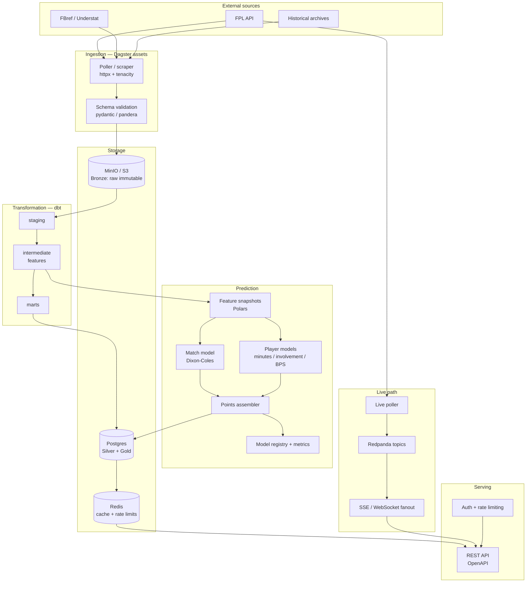

# Fantasy Premier League Data & Predictions API — Design Concept

**Status:** Concept / pre-build
**Author:** Kenneth
**Date:** July 2026

---

## 1. What this is

A read-heavy HTTP API that serves two distinct things:

1. **Curated FPL data** — players, teams, fixtures, gameweek history, prices, ownership — cleaned, normalised, and stable across seasons. This is a *data product*.
2. **Forward-looking predictions** — expected points per player per gameweek, clean-sheet probabilities, minutes probabilities.
3. **Squad and transfer optimisation** — given a manager's current squad, budget and constraints, the best transfer plan over a multi-week horizon, with support for user preferences and biases. This is a *decision product*, and it's a genuinely different discipline from prediction.

These are separated deliberately. The data layer must be trustworthy on its own, because the prediction layer is worthless if the features feeding it are wrong, and because most consumers want the data more than they want your model. Likewise the optimiser is only as good as the predictions, and it will happily amplify their errors if you let it.

### Confirmed scope

| Decision | Answer | Consequence |
|---|---|---|
| **Consumers** | Web apps and third-party developers | Browser-safe auth (publishable + secret key split), CORS, compound endpoints to avoid N+1 fetches, sparse fieldsets, generated TypeScript and Python SDKs, and a real docs site. DX is a first-class requirement, not a Phase 5 nicety. |
| **Historical seasons** | Required | Backfill from archives, not the live API — FPL only serves the current season. The hard part is cross-source, cross-season entity resolution, not volume. See §2a and §4a. |
| **Squad optimisation** | In scope, with user preferences and biases | A MILP subsystem with an async job API. Preferences supported as both hard constraints and soft objective terms. Full spec in the companion document. |

### Remaining assumptions

- Public project with a possible paid tier later. Not an enterprise SLA.
- Single-region deployment initially, with a CDN in front — the data is highly cacheable and this does most of the geographic work for you.
- Predictions are batch-computed at fixed trigger points, not per request. Optimisation *is* per request, but asynchronous.

---

## 2. Data sources

| Source | What it gives | Notes |
|---|---|---|
| `fantasy.premierleague.com/api/bootstrap-static/` | All players, teams, gameweeks, scoring rules, prices, ownership, `ep_this`/`ep_next` | The spine. Unofficial, undocumented, unversioned. Changes shape between seasons. |
| `.../fixtures/` | Full fixture list, kickoff times, FDR, results | Includes `finished`/`provisional_start_time` flags |
| `.../element-summary/{player_id}/` | Per-player per-GW history + past seasons + upcoming fixtures | One request per player (~700 players). Rate-limit carefully. |
| `.../event/{gw}/live/` | Live per-player stats and points during matches | The only real-time endpoint |
| `.../entry/{id}/...`, `.../leagues-classic/{id}/...` | Manager teams and mini-leagues | Optional; useful for a "rate my team" feature |
| FBref / Understat | xG, xA, npxG, shots, key passes, progressive actions | Not in FPL's API. This is where predictive signal beyond FPL's own numbers comes from. Scraping — respect robots.txt and rate limits. |
| `vaastav/Fantasy-Premier-League` (GitHub) | Historical FPL CSVs, 2016/17 onward | Fastest route to a backtest dataset. Verify before trusting. |
| Injury/press-conference feeds | Availability, expected return dates | FPL's `news`/`chance_of_playing_next_round` fields are the free version and are often late |

> **Important:** FPL's API is undocumented and unsupported. Treat every field as unstable. Schema-validate on ingest and fail loudly rather than silently coercing.

### 2a. Historical backfill

**The live FPL API only serves the current season.** `bootstrap-static` resets each August. `element-summary/{id}` gives a player's past seasons but only as season totals — not per gameweek, which is what you need. So historical data comes from archives, and its quality degrades as you go back.

Realistic coverage, to be verified before you commit to a start date:

| Era | FPL per-GW detail | xG / xA | Advanced defensive stats |
|---|---|---|---|
| ~2016/17 onward | Good (community archives) | Understat only | Sparse |
| ~2017/18 onward | Good | Understat + FBref | Reasonable |
| ~2022/23 onward | Good, plus FPL's own xG fields | Full | Good |
| Current season | Live API | Full | Full, incl. defensive contributions |

**Recommendation:** target **2017/18 as the modelling start date** and treat anything earlier as optional colour for the data API. You gain little from training on a pre-xG era, and features that don't exist historically will quietly poison a model that assumes they do.

Two rules that follow:

1. **Record feature availability per season** in the silver layer. A model trained on 2016/17 must not see a column that was null-filled because the source didn't exist yet. Make this explicit metadata, not something a modeller has to remember.
2. **Version the scoring ruleset per season** (see §6) and always recompute points rather than trusting archived totals. Archived `total_points` is the only sanity check you have that your ruleset implementation is right — if recomputed and archived totals diverge, you have a bug in one of them, and you want to know.

Volume is a non-issue: roughly 700 players × 38 gameweeks × 10 seasons is a few hundred thousand rows. This fits comfortably in Postgres and largely in memory. Do not let the word "historical" talk you into a bigger stack than you need.

---

## 3. High-level architecture



### Layer responsibilities

**Bronze (MinIO).** Raw payloads written exactly as received, gzipped JSON or Parquet, partitioned `source=/season=/ingested_at=`. Never mutated. This is your ability to re-derive everything when you discover a transformation bug in November, and your ability to reconstruct what the world looked like at any past deadline.

**Silver (Postgres, via dbt staging + intermediate).** Typed, deduplicated, conformed. Stable column names that survive FPL renaming things between seasons. Surrogate keys, because FPL element IDs are not stable across seasons.

**Gold (Postgres marts).** Query-shaped tables the API reads directly. Denormalised where it helps. One table per major API resource, roughly.

**Serving.** Reads gold tables and Redis. Does no computation heavier than filtering and pagination.

---

## 4. Core data model

```
dim_season          season_id, name, start_date, end_date, scoring_ruleset_id
dim_team            team_sk, season_id, fpl_team_id, name, short_name, strength_*
dim_player          player_sk, fpl_element_id, season_id, web_name, full_name,
                    position, team_sk, valid_from, valid_to, is_current   -- SCD2
dim_gameweek        gw_sk, season_id, gw_number, deadline_utc, is_current,
                    average_score, chip_plays

fct_fixture         fixture_sk, gw_sk, home_team_sk, away_team_sk, kickoff_utc,
                    home_score, away_score, fdr_home, fdr_away, status
fct_player_gw       player_sk, gw_sk, fixture_sk, minutes, goals, assists,
                    clean_sheet, goals_conceded, saves, bps, bonus,
                    defensive_contribution, yellow, red, own_goals,
                    pens_saved, pens_missed, total_points,
                    xg, xa, npxg, shots, key_passes            -- joined from FBref
fct_player_price    player_sk, as_of_date, price, transfers_in, transfers_out,
                    selected_by_percent
fct_prediction      player_sk, gw_sk, model_version, generated_at,
                    p_appearance, p_start, expected_minutes,
                    expected_points, p10, p50, p90,
                    p_clean_sheet, expected_goals, expected_assists,
                    expected_bonus, feature_snapshot_id
```

### Modelling notes that matter

- **SCD Type 2 on `dim_player`.** Players change club mid-season, get reclassified by position, and change price almost daily. Price belongs in a separate fact because it changes on a different cadence to everything else.
- **Surrogate keys everywhere.** FPL reuses element IDs across seasons for different players. Joining on `element_id` alone will silently corrupt your history.
- **Double gameweeks and blanks.** `fct_player_gw` is grained at *player × gameweek × fixture*, not player × gameweek. A player can have two fixtures in one GW or zero. Almost every naive FPL dataset gets this wrong and it poisons per-90 calculations.
- **Promoted teams** have no prior top-flight data. Your model needs an explicit cold-start path (Championship-adjusted priors, or league-average with wide uncertainty) rather than silently producing garbage.

### 4a. Cross-season identity and entity resolution

With multiple seasons in scope, two identity problems appear that don't exist in a single-season build. Both are unglamorous and both will consume more time than the modelling.

**Problem 1 — the same human across seasons.** `player_sk` is scoped to a season. You also need a stable `person_id` so that "Saka's career history" is a query rather than a heuristic. FPL element IDs are reassigned between seasons and cannot serve this purpose.

```
dim_person          person_id, canonical_name, birth_date, nationality,
                    fbref_id, understat_id, first_seen_season
dim_player          player_sk, person_id, season_id, fpl_element_id, ...
```

**Problem 2 — the same human across sources.** FPL, FBref and Understat all spell names differently, and there is no shared key. This is where projects like this actually die.

- Accents and transliteration: `Emerson` vs `Emerson Palmieri dos Santos`
- Name-order conventions: `Son Heung-min` vs `Heung-Min Son`
- FPL's `web_name` is a short display name and is not unique
- Two players with the same surname at the same club
- Mid-season transfers, so club is not a stable disambiguator

**Approach:**

1. Blocking on season + club + position to shrink the candidate set.
2. Fuzzy match on normalised names (strip accents, lowercase, sort tokens) with a similarity threshold.
3. Everything above the threshold auto-links; everything below goes to a **manual mapping seed table** checked into the repo as a dbt seed. Roughly 50–100 manual entries per season, and it's a one-time cost per season.
4. **A dbt test that fails the build** when the count of unmapped players who played over some minutes threshold exceeds zero. Silent match failures become silently missing xG, which becomes a model that mysteriously underrates certain players.

Build this in Phase 1, before the historical backfill, not after. Retrofitting identity onto loaded data is significantly worse than getting it right on the way in.

---

## 5. Point-in-time correctness

This is the single most important section, and the thing that separates a real prediction API from a toy.

**The rule:** a prediction generated for gameweek *N* may only use information that was available before the gameweek *N* deadline.

It is trivially easy to violate this without noticing:

- `bootstrap-static` fields like `form`, `points_per_game`, and `now_cost` are *overwritten in place*. If you compute features from a live pull, you are using post-deadline data.
- Injury news updates continuously. A player flagged 25% on Friday may be 100% by Saturday.
- FBref backfills and revises xG for past matches.
- A player's team can change between the deadline and when you query.

**Mitigation:**

1. **Snapshot at deadline.** A Dagster job fires at `deadline_utc - 5 minutes` and writes a complete, immutable snapshot of every input to bronze, tagged with a `feature_snapshot_id`.
2. **All features are derived from snapshots**, never from live tables. Every row in `fct_prediction` carries the `feature_snapshot_id` it was built from.
3. **Backtests replay snapshots**, not current state. If you can't reproduce a prediction from its snapshot ID, you have a bug.
4. **Effective-dating on every fact table** (`valid_from` / `valid_to` or `as_of_date`), so "what did we know on date X" is a `WHERE` clause and not an archaeology project.

If you only implement one hard thing from this document, implement this. Every backtest result you produce is meaningless without it, and models that look brilliant offline and terrible live have almost always leaked here.

---

## 6. The prediction system

### Don't predict total points directly

Total FPL points is a mixture of near-deterministic components (appearance points) and rare, high-variance ones (a defender's goal). A single regression on `total_points` learns to predict "roughly two points" for everyone and calls it a day.

Instead, decompose along the actual scoring rules and reassemble:

```
E[points] = E[appearance pts]
          + goal_pts(position) × E[goals]
          + 3 × E[assists]
          + cs_pts(position) × P(clean sheet | played 60+)
          + E[bonus]
          + E[defensive contribution pts]
          + E[save pts]                        -- GK only
          - E[goals conceded penalty]          -- GK/DEF
          - E[card penalty]
```

Each term is its own small model. This gives you interpretability for free (you can tell a user *why* Haaland is projected 7.2) and lets you improve components independently.

### Component models

**1. Minutes — the highest-leverage model.**
Everything else scales by expected minutes, so errors here dominate. Model as a three-class problem: does not appear / cameo (1–59 min) / plays 60+. Features: rotation history, minutes over last 3/5/10 GWs, days since last fixture, fixture congestion, `chance_of_playing_next_round`, news text, team's position in table, whether the fixture is a dead rubber. Gradient boosting works well here.

**2. Match model — team goal distributions.**
A Dixon–Coles / bivariate Poisson model over team attack and defence strengths, with home advantage and time-decay weighting on older matches. Fit on team-level goals (or better, xG, which is a less noisy estimate of true strength). Output is a full score matrix per fixture, which directly yields:
- P(clean sheet) for each side
- Distribution of goals conceded (needed for the −1 per 2 conceded penalty)
- Expected team goals, which becomes the denominator for player shares

**3. Player involvement — shares of team output.**
Given expected team goals *G*, a player's expected goals is `G × player_goal_share`, where the share is estimated from npxG per 90, shots per 90, penalty-taker status, and historical share of team goals. Use hierarchical shrinkage toward positional and team means: a striker with three goals in 200 minutes has a per-90 rate of 1.35, and believing that number is how you get burned.

**4. Bonus (BPS).**
BPS is deterministic given match events, so the honest approach is to simulate: sample match outcomes from the score matrix, allocate events to players, compute BPS, and rank. Cheaper approximation: regress observed bonus on expected involvement and expected minutes. Start cheap, upgrade later.

**5. Defensive contribution.**
The defensive-contribution points introduced recently reward tackles, interceptions, clearances, blocks (and recoveries for outfield attackers) above a threshold. This is genuinely predictable — defensive volume is far more stable week to week than goals — and is likely the highest-ROI signal available, because it's newer and less well modelled by the crowd. **Verify the exact thresholds and eligibility against the current season's rules before implementing.**

### Scoring rules as versioned configuration

FPL changes its scoring rules between seasons — assists definitions, bonus, defensive contributions. Hardcoding point values into model code makes historical backtests silently wrong.

```yaml
# rulesets/2026-27.yml
ruleset_id: 2026-27
appearance:
  under_60: 1
  over_60: 2
goals:
  GKP: 6
  DEF: 6
  MID: 5
  FWD: 4
clean_sheet:
  GKP: 4
  DEF: 4
  MID: 1
  FWD: 0
# ...
```

Every historical GW row references the ruleset in force at the time. Points are always recomputed through the ruleset, never read blindly from the raw feed.

### Output distributions, not point estimates

Expected points alone is insufficient for the decisions users actually make. A captaincy choice is about the upper tail; a "safe" defender is about the lower tail; a differential is about variance. Emit percentiles (`p10`, `p50`, `p90`) and the underlying component probabilities. Monte Carlo over the match model gives you these for free.

---

## 7. Evaluation and backtesting

**Baselines you must beat.** In order of embarrassment if you lose:

1. FPL's own `ep_next` field — it's free and it's right there.
2. Naive: points per game over the last 5 GWs.
3. Ownership-weighted: just predict what the crowd owns.
4. ICT index ranking.

**Metrics.** RMSE on points is a weak signal because the distribution is zero-inflated and heavy-tailed. Use a panel:

| Metric | What it tells you |
|---|---|
| Spearman rank correlation, by position | Can you rank players? This is what users actually need. |
| NDCG@15 | Are the *top* players ranked well? Errors on 4.0m benchwarmers don't matter. |
| Brier score / log loss on clean sheets and starts | Are your probabilities calibrated? |
| Calibration curves | Do things you say happen 30% of the time happen 30% of the time? |
| Backtested squad performance | Simulate a full season of a manager following the model, with real budget/transfer/3-per-club constraints, vs. the overall average. |

**Walk-forward validation only.** Train on GW 1..N, predict N+1, roll forward. Random k-fold on football data is leakage by construction.

Log every evaluation run against a model version. `fct_prediction` rows are never deleted, so you can always score old predictions against what actually happened.

---

## 8. API design

### Resources

```
GET  /v1/seasons
GET  /v1/teams?season=2026-27
GET  /v1/players?season=&position=&team=&min_price=&max_price=&sort=&page=
GET  /v1/players/{id}
GET  /v1/players/{id}/history?season=&from_gw=&to_gw=
GET  /v1/fixtures?gw=&team=&from=&to=
GET  /v1/gameweeks
GET  /v1/gameweeks/current

GET  /v1/predictions/players?gw=&horizon=6&position=&limit=
GET  /v1/predictions/players/{id}?horizon=6
GET  /v1/predictions/fixtures/{id}          # score matrix, CS probs, expected goals
GET  /v1/predictions/models                 # active versions, training dates, metrics

POST /v1/optimise/squad                     # returns a job id
GET  /v1/optimise/jobs/{job_id}

GET  /v1/live/gameweeks/{gw}                # snapshot
GET  /v1/live/gameweeks/{gw}/stream         # SSE
```

### Response shape

Predictions carry their provenance. This is non-negotiable for anything anyone will make decisions with:

```json
{
  "player_id": 427,
  "web_name": "Saka",
  "gameweek": 12,
  "fixtures": [
    { "opponent": "BOU", "home": true, "difficulty": 2 }
  ],
  "prediction": {
    "expected_points": 6.41,
    "p10": 1.0,
    "p50": 5.0,
    "p90": 13.0,
    "components": {
      "appearance": 1.84,
      "goals": 1.92,
      "assists": 1.35,
      "clean_sheet": 0.31,
      "bonus": 0.71,
      "defensive_contribution": 0.28
    },
    "probabilities": {
      "starts": 0.88,
      "plays_60_plus": 0.81,
      "returns": 0.52,
      "hauls_10_plus": 0.14
    }
  },
  "meta": {
    "model_version": "ensemble-v3.2.1",
    "generated_at": "2026-11-07T17:25:00Z",
    "feature_snapshot_id": "2026-27-gw12-deadline",
    "valid_until": "2026-11-08T11:00:00Z"
  }
}
```

### Cross-cutting

- **Versioning in the path** (`/v1`). Scoring rules and model outputs will change shape; you will need a breaking version eventually.
- **OpenAPI spec generated from code**, served at `/openapi.json`. You've been through Swagger generation pain on the Go project — decide the source of truth once, up front.
- **Cursor pagination**, not offset. Player lists are small but history isn't.
- **`ETag` and `Cache-Control`.** FPL data is extraordinarily cacheable outside match windows. `bootstrap-static` meaningfully changes about once a day; during live matches it changes constantly. Two cache profiles, switched by a "is a match in progress" flag.
- **Idempotency keys** on the optimisation POST.
- **RFC 9457 problem-details error envelope**, consistently, everywhere. Third-party developers will judge your API on its error messages more than on its happy path.
- **`Deprecation` and `Sunset` headers** when retiring endpoints, plus a public changelog.

### Serving web apps and third-party developers

The confirmed consumer mix drives several concrete requirements.

**Split key types.** A browser cannot keep a secret, so don't pretend otherwise.

| Key type | Where it lives | Scope | Controls |
|---|---|---|---|
| Publishable (`pk_...`) | Browser, shipped in JS bundles | Read-only data + predictions | HTTP `Origin` allowlist per key, low rate limit, no optimisation access |
| Secret (`sk_...`) | Server-side only | Everything, including optimisation jobs | High rate limit, no origin restriction |

Reject any request presenting a secret key with a browser `Origin` header, and say clearly in the error why. That single check will save some developer from leaking their key, and it's the sort of thing that earns trust.

**CORS**, with preflight caching (`Access-Control-Max-Age`) so browsers aren't doing an OPTIONS round trip before every call.

**A compound bootstrap endpoint.** Web apps need teams, players, current gameweek and fixtures to render their first screen. Making them issue four requests — or worse, one per player — is the most common reason a nice API feels slow.

```
GET /v1/bootstrap?season=2026-27
→ { season, teams[], players[] (summary fields), gameweeks[], fixtures[], meta }
```

Aggressively `ETag`'d and CDN-cached. One request, one round trip, app renders.

**Sparse fieldsets.** `?fields=id,web_name,price,expected_points` — a mobile web app fetching 700 full player objects to render a table is wasting most of the payload. Cheap to implement, disproportionately appreciated.

**Bulk-by-ID lookups.** `GET /v1/players?ids=1,17,233,427` so clients never write an N+1 loop. If you don't provide this, they will write the loop, and then they will complain that your API is rate-limiting them.

**Generated SDKs.** TypeScript first — that's what a web app consumer wants, and typed responses are the single biggest DX win available. Python second. Generate both from the OpenAPI spec in CI so they cannot drift.

**A docs site with a live sandbox key.** Runnable examples against real data, no signup required to try it. The gap between "reads the docs" and "makes a successful call" is where most API adoption is lost.

**A CDN in front of everything** (Cloudflare or similar). Given how cacheable this data is outside match windows, edge caching will serve the large majority of your traffic, flatten the deadline-day spike, and let you run a much smaller origin than you'd otherwise need.

---

## 9. The live gameweek path

This is where Redpanda earns its place, and it's the only part of the system that's genuinely streaming.

```
Poller (every 20–30s during match windows)
  → GET /event/{gw}/live/
  → diff against last known state
  → emit only changed players to topic `fpl.live.player_events`
  → consumers:
       - projector → Redis (current live state, served by REST)
       - SSE/WS fanout → connected clients
       - archiver → MinIO (event log, for reconstructing match timelines)
```

Design notes:

- **Poll only during match windows.** Derive windows from the fixture table. Outside them, poll hourly. This cuts request volume by ~95% and keeps you a good citizen.
- **Emit deltas, not full state.** Full-state broadcast to thousands of SSE clients every 20 seconds is how you set money on fire.
- **Provisional bonus.** Bonus points aren't confirmed until after the match. Compute provisional bonus from live BPS and mark it clearly as provisional — users will scream either way, but at least they'll be informed.
- **Backpressure.** If a consumer is slow, drop to the latest state rather than queueing every intermediate delta. Clients want current truth, not history.

---

## 10. Non-functional requirements

| Concern | Target / approach |
|---|---|
| Read latency | p95 < 150ms for cached data endpoints, < 400ms for prediction queries |
| Availability | 99.5% outside deadline windows; 99.9% in the 6h before a deadline |
| Traffic shape | Extremely spiky. Enormous spike in the 60 minutes before each deadline and during Saturday 15:00 kickoffs. Autoscale on that schedule; it's known in advance from the fixture table. |
| Freshness | Prices update ~01:30 UTC daily. Predictions regenerate after each price change and after each fixture completes. |
| Data quality | dbt tests + Great Expectations on every run: uniqueness on grain, non-null on keys, referential integrity, range checks on points, row-count deltas vs. expectation. Fail the pipeline; don't publish bad data. |
| Observability | Structured logs, request tracing, Dagster asset-level alerting, plus a prediction-drift dashboard (feature distributions vs. training) |
| Disaster recovery | Bronze in MinIO is the source of truth. Full rebuild from raw should be a documented, tested command — not a theory. |
| Cost | Modest. A single small Postgres, object storage, one API instance, one worker. The expensive part is your time. |

---

## 11. Legal and ethical constraints

Worth being deliberate about, especially if you ever charge for it:

- The FPL API is **undocumented and unofficial**. There is no contract; it can change or close without notice. Your architecture should survive that (bronze layer, adapter pattern on ingestion).
- Premier League data and branding are **proprietary**. Serving bulk verbatim copies of their feed is different from serving derived analytics. Review the Premier League and FPL terms before commercialising, and don't use their marks.
- FBref, Understat and similar have their own terms. **Respect robots.txt, rate-limit conservatively, and set an honest User-Agent** with contact details.
- Cache aggressively — it's better for you and it's the polite thing to do.
- Don't expose other managers' team data beyond what FPL already makes public, and don't build features that make it easy to harvest at scale.

---

## 12. Technology choices

Given your existing stack, the obvious-and-correct path:

| Layer | Choice | Why |
|---|---|---|
| Orchestration | **Dagster** | Asset-based model fits this perfectly. Each snapshot, each model, each mart is an asset with lineage. Partitions map naturally onto gameweeks. |
| Transformation | **dbt** on Postgres | Tests, lineage, and documentation you'd otherwise write by hand |
| Feature engineering | **Polars** | Window functions over player-gameweek panels are exactly its strength, and rolling per-90 features on ~700 players × 38 GWs is small enough to stay in memory comfortably |
| Storage | **MinIO** (bronze) + **Postgres** (silver/gold) | Already in your local setup. Postgres is more than sufficient at this data volume — this is megabytes, not terabytes. Resist the urge to reach for anything bigger. |
| Streaming | **Redpanda** | Only for the live path. Don't force the batch pipeline through it. |
| Modelling | Python: scikit-learn / LightGBM, plus statsmodels or a hand-rolled Dixon-Coles | Well-trodden; the football-modelling literature is all Python |
| Optimisation | PuLP or OR-Tools (MILP) | Squad selection is a knapsack with side constraints; solvers handle it in under a second |
| API | **FastAPI** or **Go** — see below | |
| Cache / rate limiting | Redis | |

### The one real decision: FastAPI or Go for serving

**FastAPI.** One language end to end. Pydantic models shared between pipeline and API. OpenAPI generated automatically and correctly. You can call models in-process if you ever want on-demand inference. Fastest path to shipping.

**Go.** Better resource profile under the deadline-day spike and for holding thousands of SSE connections. Continues the muscle you've been building on `production-go-api`. But it means a hard contract boundary — Python writes to Postgres, Go reads from it — with schema drift as a permanent hazard, and you'll write the OpenAPI spec by hand or via codegen.

**Recommendation:** start with FastAPI. Ship the whole thing. If the live/SSE path becomes a bottleneck, extract *just that service* into Go, where its advantages are real and the contract is a single narrow event schema rather than your whole data model. Splitting languages before you have a measured problem buys you overhead and nothing else.

---

## 13. Delivery phases

**Phase 0 — Foundation (1–2 weeks)**
Dagster project scaffolded. Ingest `bootstrap-static` and `fixtures` on a schedule into MinIO. Schema validation with pydantic. dbt staging models. Postgres up. One test asserting you can rebuild silver from bronze.

**Phase 1 — Identity and history (2–3 weeks)**
Full dimensional model including SCD2 on players and `dim_person` for cross-season identity. Entity-resolution pipeline with the manual mapping seed and its failing test (§4a). Historical backfill 2017/18 onward. `element-summary` ingestion with polite concurrency. Do identity *before* the bulk load.

**Phase 1b — Data API (2 weeks)**
FastAPI serving players, teams, fixtures, gameweeks, history, plus the compound `/bootstrap` endpoint. OpenAPI spec, generated TypeScript SDK, publishable/secret key split, CORS, rate limiting, CDN. Docs site with a sandbox key. **Deploy it.** A live, boring data API is more valuable than a brilliant local model.

**Phase 2 — Point-in-time infrastructure (1–2 weeks)**
Deadline snapshot job. `feature_snapshot_id` plumbing. Walk-forward backtest harness with baselines wired in. No models yet — just the ability to evaluate one honestly. Doing this before the modelling is what makes the modelling worth anything.

**Phase 3 — Baseline predictions (2–3 weeks)**
Minutes model. Dixon-Coles match model. Simple involvement shares. Assemble to expected points through the ruleset config. Beat `ep_next` on rank correlation, or find out why you can't. Ship `/v1/predictions/*`.

**Phase 4 — Refinement**
xG/xA ingestion from FBref. Hierarchical shrinkage on rate stats. BPS simulation. Defensive-contribution model. Distributional outputs. Model registry and drift monitoring.

**Phase 5 — Squad optimiser (3–4 weeks)**
MILP over a multi-week horizon: budget, formation, club limits, transfer costs, free-transfer rollover, sell-price rules. Hard and soft user preferences. Async job API. The "cost of your bias" comparison. Alternative-plan generation. Full spec in the companion document.

**Phase 6 — Live path**
Redpanda live poller with SSE fanout, provisional bonus, delta emission. Deliberately last: it's the most operationally demanding piece and the least differentiating, since several sites already do live points well.

---

## 14. Principal risks

| Risk | Impact | Mitigation |
|---|---|---|
| **Leakage in features** | Model looks great offline, fails live. Silent and demoralising. | Phase 2 before Phase 3. Snapshot discipline. Every prediction reproducible from its snapshot ID. |
| FPL changes API shape mid-season | Pipeline breaks at the worst moment | Schema validation on ingest with loud alerts; adapter layer isolating raw shape from silver; bronze lets you replay after fixing |
| Scoring rules change between seasons | Historical backtests silently invalid | Versioned ruleset config; recompute points, never trust raw totals |
| Double gameweeks / blanks mishandled | Per-90 stats and expected points quietly wrong | Grain at player × gameweek × fixture from day one; explicit tests for DGW rows |
| Small-sample per-90 rates | Wildly overconfident predictions for fringe players | Hierarchical shrinkage; minimum-minutes gates; wide intervals communicated in the response |
| Getting rate-limited or blocked | No data | Conservative polling, aggressive caching, honest User-Agent, exponential backoff |
| Scope creep into a full FPL web app | Never ships | The API is the product. Build a client only after the API is live. |

---

## 15. What makes this actually good

Most FPL prediction projects are a notebook with a gradient booster on `total_points`. The things that would make this a genuine portfolio piece — and the things a data engineering interviewer would care about — are, roughly in order:

1. **Point-in-time correctness that you can demonstrate.** "Here's a prediction from GW12, here's the exact snapshot it was built from, here's the reproduction." Almost nobody does this.
2. **A component decomposition that explains itself.** Users can see *why*, and you can debug which part is wrong.
3. **Calibrated probabilities, not just point estimates.** Publish your calibration curves.
4. **A backtest against real baselines**, including FPL's own projection, published honestly — including where you lose.
5. **The pipeline itself.** Dagster lineage, dbt tests, bronze/silver/gold, a rebuild-from-raw command that actually works. This is the part that's closest to your day job at Ember and the part most FPL projects skip entirely.

---

## Appendix A — Feature catalogue sketch

**Player rolling (windows: 3, 5, 10 GW, and season-to-date)**
minutes, starts, goals, assists, npxG, xA, shots, shots in box, key passes, touches in opposition box, big chances, BPS, defensive actions, saves

**Player static / slow-moving**
position, price, price trajectory, ownership %, penalty-taker order, set-piece duties, age, days since injury return

**Team**
attack strength, defence strength (both from the match model), home/away split, xG for/against, form, days since last fixture, fixture congestion over next 14 days, European competition involvement

**Fixture**
opponent strength, home/away, FDR, kickoff time, days rest differential, whether the fixture is part of a double gameweek

**Context**
gameweek number, whether the match is late in a season with nothing at stake, manager change within last 3 GWs, days since transfer window closed

---

## Appendix B — Suggested repository layout

```
fpl-api/
├── ingestion/          # Dagster assets: pollers, scrapers, validators
│   ├── assets/
│   ├── resources/      # FPL client, MinIO, Postgres
│   └── schedules/      # deadline-triggered, daily, live-window
├── transform/          # dbt project
│   ├── models/{staging,intermediate,marts}/
│   ├── tests/
│   └── seeds/          # rulesets, team name mappings
├── modelling/
│   ├── features/       # Polars feature builders
│   ├── match/          # Dixon-Coles
│   ├── players/        # minutes, involvement, bps
│   ├── assemble/       # ruleset-driven points assembly
│   └── evaluate/       # backtest harness, baselines, metrics
├── api/
│   ├── routers/
│   ├── schemas/        # pydantic response models
│   ├── deps/           # auth, rate limiting, db sessions
│   └── live/           # SSE, Redpanda consumer
├── rulesets/           # 2024-25.yml, 2025-26.yml, 2026-27.yml
├── infra/              # docker-compose, migrations, deploy
└── docs/
```
